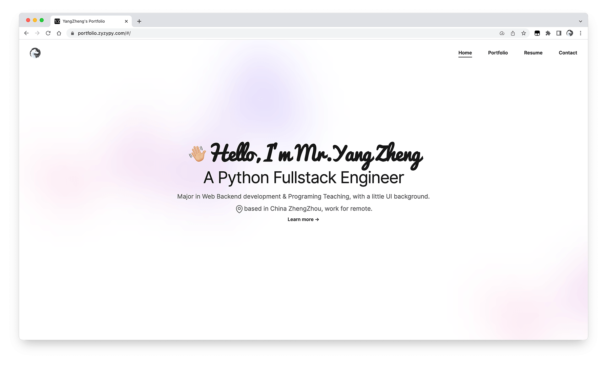
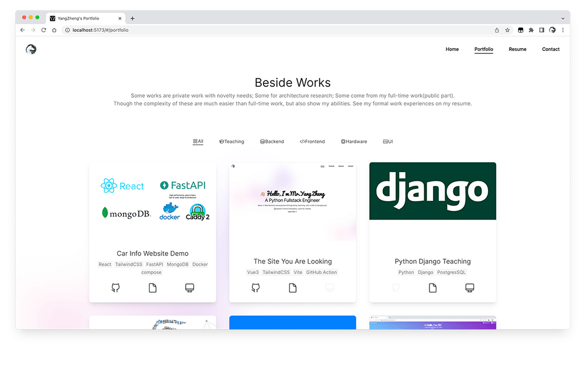

My Portfolio
===
## Brief
Status:  
Year: 2022  

Introduce:  
My portfolio, a summary of the past decade.  

[Portfolio](https://portfolio.zyzypy.com)

## Tech Stack
- Vue3
- Vite
- TailwindCSS
- GitHub Actions

Personal Opinion:  
- Vue3, `<script setup>` syntax used in this project. This new feature claims you don't need to consider what `this` indicate to.
But I consider there are some disadvantages verses 'class' syntax:   
  - Free writing style is not uniform among different people.  
  - Cost of studying, you need to study or search in docs if you want to use `ref` `computed` which need new import sentence.
  Frontend ecology changes rapidly, syntax even changes from Vue 3.0 to 3.2 .
- TailwindCSS, it's not often to see a CSS framework becoming so popular. Though official says it has many features, 
but it's really similar to Bootstrap, resulting the Cons and Pros:  
  - In-line style, causing low readability.  
  - Most of the official UI Components and third-party are paid or doesn't satisfy my demand.
  - Easy to development, validate ideas, easy to modify. I manually wrote almost all of CSS style for this project.
    It's a large work for a backend coder.  
    

## Screen shot
View on Mac for correct vision, may typographical error on Windows, no compatible mobile phone.  

## License
Delete or replace my private info in 
/public/RESUME/myCV.pdf, WORKS_INFO.js, /src/pages/resume.vue, /src/pages/contact.vue 
if you use this project.